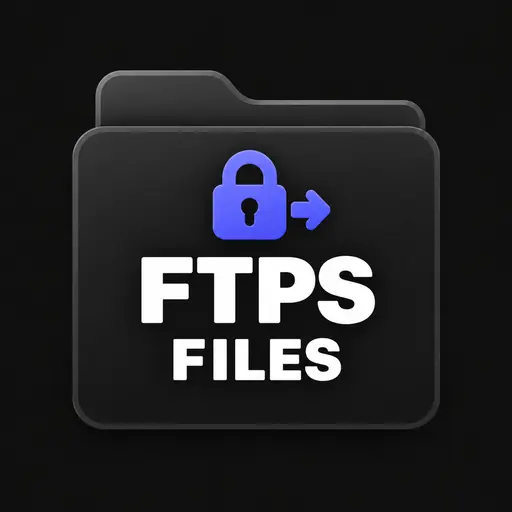

# File Browser FTPS access

Browse and manage files on an FTPS server directly from Agent Zero’s File Browser. Useful for website hosting and other servers that offer secure FTP access.

## Compatibility

**Requires Agent Zero v2.12 or later.**

## Install and configure

1. Open **Plugin Hub**, find **File Browser FTPS access**, and install it.
2. Enable the plugin globally, then open its settings and choose **Open connection settings**. You can also go to **Files → Settings → Add connection** and choose this plugin.
3. Enter the connection details described below, give the connection a name, and save it.
4. Test the connection, then use its folder icon to open your files.

Enter server, port (21), absolute folder, registered username and password. The server must support explicit TLS, private data channels, passive transfers and MLSD. An optional trusted CA file is an absolute path inside the Agent Zero instance. Plain FTP, anonymous accounts and implicit port-990 FTPS are not supported.

## Use and permissions

Each connection has independent Browse, Download, Upload/create, Edit, Rename/move and Delete controls; unsupported actions are disabled. Browse and Download default on; mutations default off. Text and code files open in the shared Editor. Files supports list/icon views and the optional file tree for remote connections.

Permissions constrain File Browser operations, not arbitrary agent shell tools or server accounts. Editing necessarily reveals file content. Credentials are stored privately (0600) under this plugin's `data/connections.json` and are omitted from browser responses. An unchanged secret retains its saved value; replacing it updates it. Protect the instance and its backups.

## Limits

FTPS has no standard conditional rename. New writes and moves check for existing destinations, but another client can race those checks. Edits use a temporary upload and content-hash check before RNTO. Servers unable to replace via RNTO fail without deleting the original. Use a server-side jailed account; only ordinary MLSD files/directories are listed. No symlink traversal is intended, but server-side path confinement is authoritative.

Set size limits in File Browser settings: transfers default to 100 MiB, text editing to 10 MiB, and archives to 1,000 entries. Transfers stream through temporary files; text editing supports UTF-8 files without binary content. Cross-connection moves and remote-to-local Save As are not supported. Use download/upload to transfer between connection types. Agent Zero must be able to reach the configured server; storage/network charges remain your provider's responsibility.

## Technical details

The adapter uses the Agent Zero v2.12 streaming interface: `read(relative, destination, limit)` writes bounded chunks and returns a revision; `write(relative, source, expected=None)` consumes a seekable binary stream and returns the new revision. Transfer limits come from File Browser settings.

Dependencies: Python standard library (ftplib and ssl); no package installation needed. This plugin needs no install hook because it uses only the Python standard library.

## Verification

Transport checks cover streamed transfers above 1 MiB, size-limit rejection, and safe-write behavior. Tests use disposable local servers or SDK mocks, without production credentials.

Actual isolated FTP server verifies TLS on control and data channels, read/create/save/rename/delete, stale-save and duplicate-create rejection, and untrusted certificate rejection. Run `PYTHONPATH=/a0 python -m unittest -v test_transport` from the repository inside the Agent Zero container, using its framework interpreter; OpenSSL creates a disposable test certificate.

Before production use, test a disposable folder on your actual server: listing, new upload, Editor save, duplicate destination rejection, stale-save rejection, download, rename where supported, and deletion. Confirm denied actions remain denied and disable the plugin to confirm connections become unavailable. Protocol differences and server permissions matter.

## Disable and remove

Disabling hides this provider and rejects further connection operations. Removing a connection deletes its saved credentials. Uninstalling deletes the plugin directory, including saved connections and any plugin-owned key; back up what you need first. Shared Python dependencies are not uninstalled because other plugins may use them. No service, mount or system symlink is created.

## License

MIT. See [LICENSE](LICENSE). Agent Zero-derived integration retains its upstream license notice.
